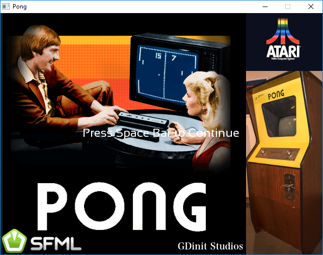
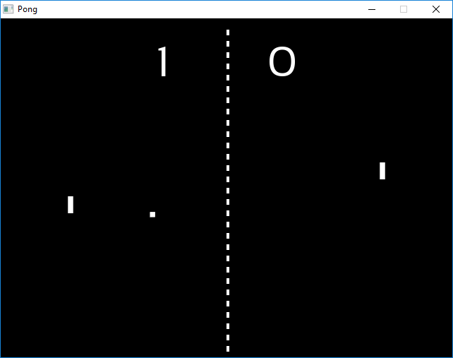

# PONG
### A clone of the Classic Game Pong by gdinit
***This Software is in pre-release phase!***

Intro
--------------
Everybody knows Pong, right?

Screenshots
--------------
Here is two!

 

Install
-------
There is a pre-release Windows binary available under releases.

Credits
-------
Please refer to "documentation/".

License
-------
See the additional LICENSE file, under "documentation/".
